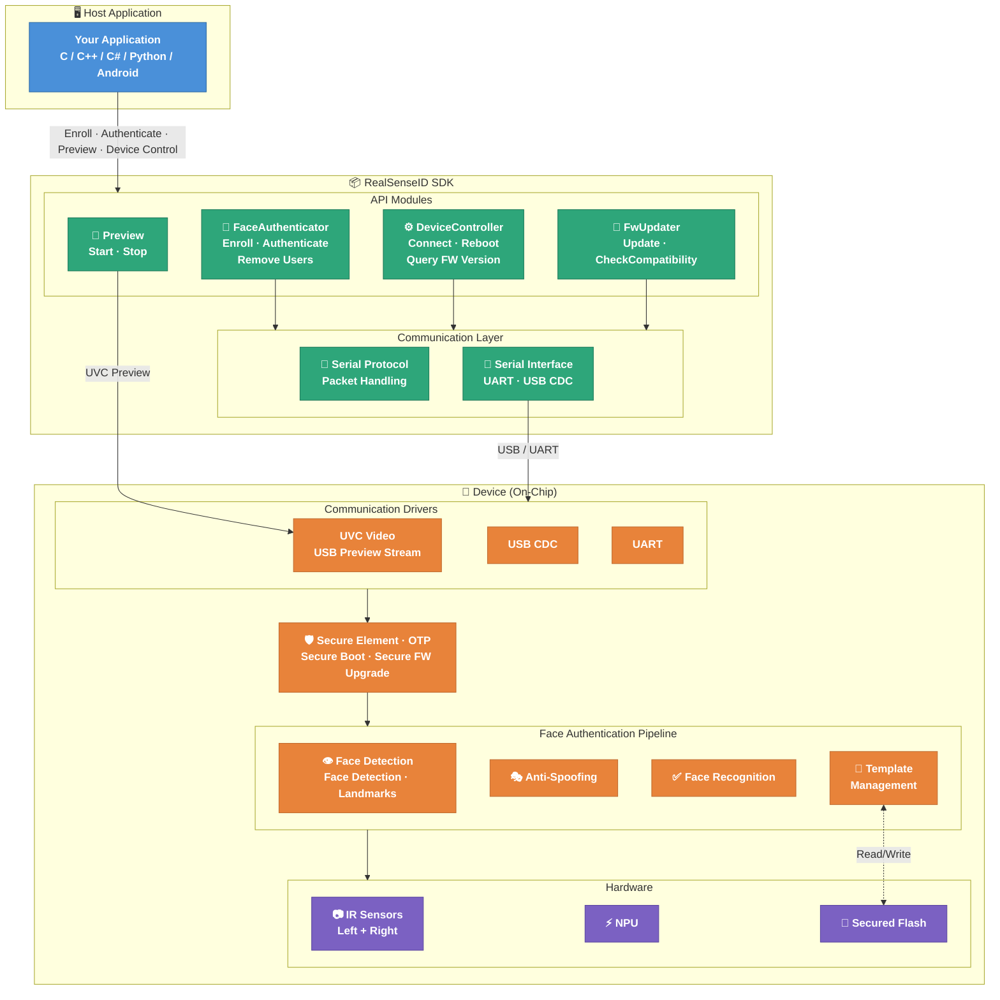

<p align="center">
<!-- Light mode -->


<!-- Dark mode -->

<br><br>
</p>

<p align="center">RealSense™ ID SDK is a cross-platform library for facial authentication solution.</p>

<p align="center">
  <a href="https://www.apache.org/licenses/LICENSE-2.0"></a>
  <a href="https://github.com/realsenseai/RealSenseID/releases/latest"></a>
  <a href="https://github.com/realsenseai/RealSenseID/network/members"></a>
</p>

## Important Notice

We are happy to announce that the RealSense GitHub repositories have been successfully migrated to the RealSenseAI organization.
Please make sure to update your links to the new RealSenseAI organization for both cloning the repositories and accessing specific files within them.

[https://github.com/**IntelRealSense**/RealSenseID](https://github.com/IntelRealSense/RealSenseID) --> [https://github.com/**realsenseai**/RealSenseID](https://github.com/realsenseai/RealSenseID)

> Note: A redirection from the previous name IntelRealSense is currently in place, but we cannot guarantee how long it will remain active. We recommend that all users update their references to point to the new GitHub location.

## Table of Contents

1. [Overview](#overview)
2. [Platforms](#platforms)
3. [Building](#building)
4. [Sample Code](#sample-code)
5. [Operation Modes](#operation-modes)
6. [Project Structure](#project-structure)
7. [Secure Communication](#secure-communication)
8. [License](#license)
9. [RealSense™ ID Device Architecture Diagram](#realsense-id-device-architecture-diagram)

## Overview

RealSense™ ID is a trusted on-device facial authentication solution.

The RealSense™ ID module performs face authentication on a closed real-time operating system (RTOS) using neural network–based algorithms, delivering secure, accurate recognition that adapts to users over time. Privacy is built in — authentication requires active user awareness, and anti-spoofing technology guards against attacks using photographs, videos, or masks.

Designed to work for everyone, from children to tall adults, RealSense™ ID simplifies secure entry across Smart Locks, Access Control, PoS, ATMs, and Kiosks.

Developer kits are available for purchase at [store.realsenseai.com](https://store.realsenseai.com/). For more on the technology, visit [realsenseai.com/facial-authentication](https://www.realsenseai.com/facial-authentication/).

For high-level architecture, see the [RealSense™ ID Architecture Diagram](#realsense-id-device-architecture-diagram).

> **Note:** "Device" throughout this document refers to the RealSense™ ID F450 / F455 / F500 / F505.

## AI Usage

See [SKILL.md](./SKILL.md) for guidance when using this SDK with AI tools.

## Platforms

- Linux (Ubuntu 18.04+, Raspberry Pi 4+, Jetson)
- Windows (Windows 10+)
- macOS 12+ (Apple Silicon; face-auth path only — preview/libuvc unsupported)
- Android 8-16

## Bindings

- C/C++
- Python
- C#
- Android

## Building

### Quick Start

```bash
# Linux
scripts/build.sh

# Windows
scripts\build.bat
```

This builds the library and tools in Release mode. Use `--help` (or `/help`) to see optional flags.

### Manual CMake

Use CMake version 3.14 or above:

```console
$ cd <project_dir>
$ mkdir build && cd build
$ cmake ..
$ cmake --build . --config Debug
```

### CMake Options

The following options are available for the `cmake` command

| Option               | Default | Description                                                                 |
| -------------------- | :-----: | :-------------------------------------------------------------------------- |
| `RSID_DEBUG_CONSOLE` |  `ON`   | Log everything to console                                                   |
| `RSID_DEBUG_FILE`    |  `OFF`  | Log everything to _rsid_debug.log_ file                                     |
| `RSID_DEBUG_SERIAL`  |  `OFF`  | Log all serial communication                                                |
| `RSID_DEBUG_PACKETS` |  `OFF`  | Log packets sent/received over the serial line                              |
| `RSID_DEBUG_VALUES`  |  `OFF`  | Replace default common values with debug ones                               |
| `RSID_SAMPLES`       |  `OFF`  | Build samples                                                               |
| `RSID_TIDY`          |  `OFF`  | Enable clang-tidy                                                           |
| `RSID_PEDANTIC`      |  `OFF`  | Enable extra compiler warnings                                              |
| `RSID_PROTECT_STACK` |  `OFF`  | Enable stack protection compiler flags                                      |
| `RSID_DOXYGEN`       |  `OFF`  | Build doxygen documentation                                                 |
| `RSID_SECURE`        |  `OFF`  | Enable secure communication with device                                     |
| `RSID_TOOLS`         |  `ON`   | Build additional tools                                                      |
| `RSID_PY`            |  `OFF`  | Build Python wrapper                                                        |
| `RSID_PREVIEW`       |  `OFF`  | Enable preview feature                                                      |
| `RSID_LIBUVC`        |  `OFF`  | Use libuvc instead of V4L2 for preview (Linux only; forced `ON` on Android) |
| `RSID_TESTS`         |  `OFF`  | Build unit tests                                                            |
| `RSID_INSTALL`       |  `OFF`  | Generate the install target and rsidConfig.cmake (not available on Android) |

### Linux Post Install

In order to install the udev rules for the RealSense™ ID devices, run the command:

```bash
sudo script/udev-setup.sh -i
```

Note: You can undo the changes/uninstall by using the `-u` flag.

The capture device will be available to `plugdev` users while the serial port will be available to `dialout` users.
On Debian/Ubuntu, you can add current user to those groups by issuing the commands:

```bash
sudo adduser $USER dialout
sudo adduser $USER plugdev
```

Note: Changes in group membership will take effect after logout/login (or reboot).

### Windows Post Install

In order to be able to capture metadata for RAW format, open a `PowerShell` terminal as Administrator and run the command

```shell
# F450 / F455
.\scripts\realsenseid_metadata_win10-f450.ps1

# F500 / F505
.\scripts\realsenseid_metadata_win10-f500.ps1
```

### macOS Notes

The face-auth path (FaceAuthenticator, DeviceController, FwUpdater) builds and runs on macOS using the existing POSIX `LinuxSerial` implementation. Build with `-DRSID_PREVIEW=OFF`; the preview pipeline (libuvc) is not yet supported on macOS.

`discover_devices()` walks `/sys/bus/usb/` (Linux-only) and returns an empty list on macOS. Pass the F455's serial port directly to `FaceAuthenticator(<port>)`. Locate it with:

```bash
ls /dev/cu.usbmodem*
```

## Sample Code

This snippet shows the basic usage of our library.

```cpp
RealSenseID::FaceAuthenticator authenticator;
connect_status = authenticator.Connect({"COM4"});

// Enroll a user
const char* user_id = "John";
MyEnrollClbk enroll_clbk;
auto status = authenticator.Enroll(enroll_clbk, user_id);

// Authenticate a user
MyAuthClbk auth_clbk;
status = authenticator.Authenticate(auth_clbk);

// Remove the user from device
success = authenticator.RemoveUser(user_id);

```

For additional languages, build instruction and detailed code please see our code [samples](./samples) and [tools](tools).

## Operation Modes

### Device Mode

Device Mode is a set of APIs that enable the user to enroll and authenticate on the device itself,
including database management and matching on the device.

### Host Mode

Host Mode is a set of APIs for users who wish to manage a faceprints database
on the host or the server. In this mode the RealSenseID camera is used as a Feature-Extraction device only.

The API provides a 'matching' function which predicts whether two faceprints belong to the same person,
thus enabling the user to scan their database for similar users.

## Project Structure

The SDK is organized into the following directories:

| Directory                                    | Contents                                                        |
| -------------------------------------------- | --------------------------------------------------------------- |
| [include/RealSenseID/](include/RealSenseID/) | Public C++ API headers                                          |
| [samples/](samples/)                         | Code samples in C++, C, Python, and C#                          |
| [tools/](tools/)                             | Command-line tools: `rsid-cli`, `rsid-fw-update`, `rsid-viewer` |
| [wrappers/](wrappers/)                       | Language bindings: C, Python, C#, Android                       |

For the full C++ API reference — including `FaceAuthenticator`, `DeviceController`, `Preview`, and `FwUpdater` — see [include/RealSenseID/README.md](include/RealSenseID/README.md).

## Secure Communication

The library can be compiled in secure mode. Once paired with the device, all communications will be protected.
If you wish to get back to non-secure communications, you must first unpair your device.

Cryptographic algorithms that are used for session protection:

- Message signing - ECDSA P-256 (secp256-r1).
- Shared session key generation - ECDH P-256 (secp256-r1)
- Message encryption - AES-256, CTR mode.
- Message integrity - HKDF-256.

To enable secure mode, the host should perform the following steps:

- Compile the library with RSID_SECURE enabled.
- Generate a set of ECDSA P-256 (secp256-r1) public and private keys. The host is responsible for keeping his private key safe.
- Pair with the device to enable secure communication. Pairing is performed once using the FaceAuthenticator API.
- Implement a SignatureCallback. Signing and verifying is done with the ECDSA P-256 (secp256-r1) keys. Please see the pairing sample on how to pair the device and use keys.

Each request from the host to the device starts a new encrypted session, which performs an ECDH P-256 (secp256-r1) key exchange to create the shared secret for encrypting the current session.

```cpp
class MySigClbk : public RealSenseID::SignatureCallback
{
public:
    bool Sign(const unsigned char* buffer, const unsigned int buffer_len, unsigned char* out_sig) override
    {
      // Sign buffer with host ECDSA private key
    }

    bool Verify(const unsigned char* buffer, const unsigned int buffer_len, const unsigned char* sig,const unsigned int sign_len) override
    {
      // Verify buffer with device ECDSA public key
    }
};

MySigClbk sig_clbk;
RealSenseID::FaceAuthenticator authenticator {&sig_clbk};
Status connect_status = authenticator.Connect({"COM9"});
authenticator.Disconnect();
char* hostPubKey = getHostPubKey(); // 64 bytes ECDSA public key of the host
char host_pubkey_signature[64];
if (!sig_clbk.Sign((unsigned char*)hostPubKey, 64, host_pubkey_signature))
{
    printf("Failed to sign host ECDSA key\n");
    return;
}
char device_pubkey[64]; // Save this key after getting it to use it for verification
Status pair_status = authenticator.Pair(host_pubkey, host_pubkey_signature, device_pubkey);
```

## Python API

```python
"""
Authenticate example
"""
import rsid_py

def on_result(result, user_id):
    if result == rsid_py.AuthenticateStatus.Success:
        print('Authenticated user:', user_id)

with rsid_py.FaceAuthenticator("COM4") as f:
    f.authenticate(on_result=on_result)

```

Please visit the python [samples](./samples/python) page for details and samples.

## License

This project is licensed under Apache 2.0 license. Relevant license info can be found in "License Notices" folder.

## RealSense™ ID Device Architecture Diagram


